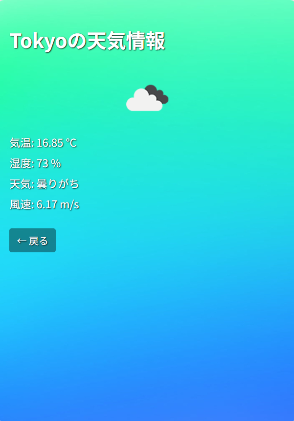
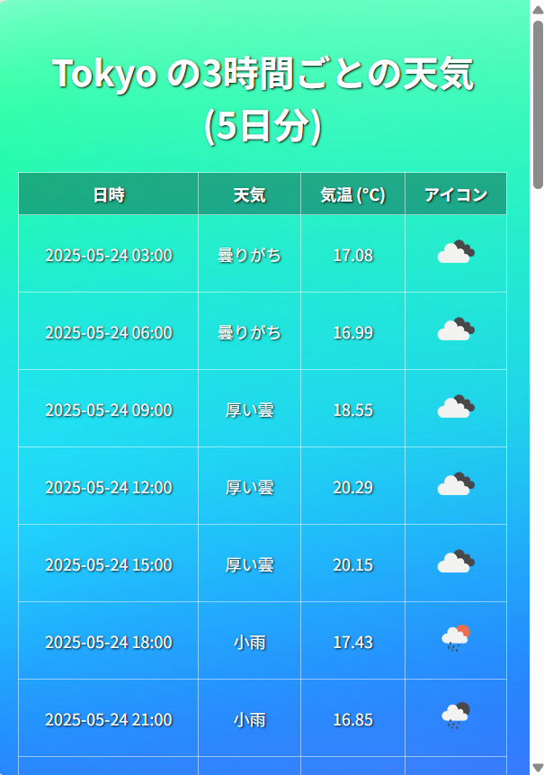

# 天気予報Webアプリ
Spring BootとThymeleafで構築されたシンプルな天気予報Webアプリケーションです。

OpenWeatherMap APIを利用して、指定した都市の「現在の天気」と「3時間ごとの天気(5日分)」を取得・表示できるようにしました。





## 概要

- **主な機能・使用方法**:
  - 画面上部のバナーにあるボタンで検索モード(現在の天気・5日分の3時間ごとの天気)を選択
  - 都市名を入力して天気を検索
  - 現在の天気情報を表示(天気、天気アイコン、気温、湿度、風速)
  - 5日分の3時間ごとの天気予報リストを表示(最大40件)
  - 画面下部の戻るボタンで検索画面に戻ります

  **使用言語**:
  - HTML/CSS(アプリのUI、バナー、ボタン、スクロール操作、天気アイコンや天気情報の表示)
  - Java(API管理、検索モードの構築、位置情報の取得、天気情報の取得、エラー処理)

## 🛠️動作環境
- JDK 24(Java 11+)
- Spring Boot
- Thymeleaf(HTMLテンプレートエンジン)
- OpenWeatherMap API
- HTML/CSS(背景画像・検索ボタン・レスポンシブ対応)
- Maven

## 🌐APIキーを設定
このアプリを実行するには、OpenWeatherMap APIキーが必要です。

1. [OpenWeatherMapのAPIキー取得ページ](https://home.openweathermap.org/api_keys)から無料のAPIキーを取得
2. application.propertiesにAPIキーを設定

   ```properties
   weather.api.key=あなたのAPIキー
   ```

## 🚀実行方法
1. **リポジトリのクローン**

   ```bash
   git clone https://github.com/motomasMINO/WeatherApp-Web.git
   cd WeatherApp-Web
   ```

2. アプリ起動

   ```bash
   ./mvnw spring-boot:run
   ```
 
3. ブラウザでアクセス

   http://localhost:8080
   
## 📜ライセンス
このプロジェクトはMIT Licenseのもとで公開されています。

## 📧お問い合わせ
- **GitHub: motomasMINO**

- **Email: yu120615@gmail.com**

  バグ報告や改善点・機能追加の提案はPull RequestまたはIssueで受け付けています!
